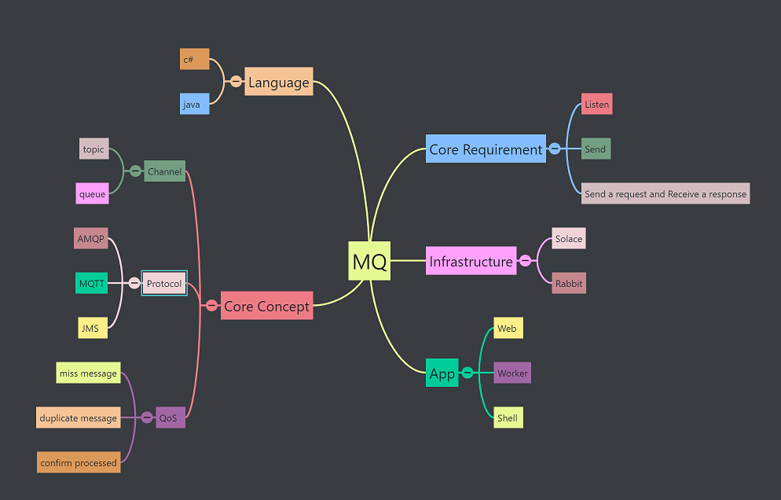
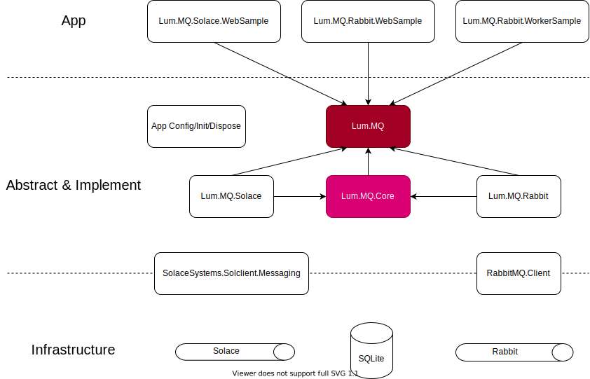

# LumQ
A Common MQ Lib by C#, https://github.com/luminyang/Lum.MQ.Sample

Now it's a Lab more than a lib, my developing toy.

You can have a quick look with lumQ.blinkmind & lumQ.drawio, changelog.txt is my dev journal.

## Concern points

## Architect

There are some interesting tools for design visualization
 - Drawio
 - Blink Mind
